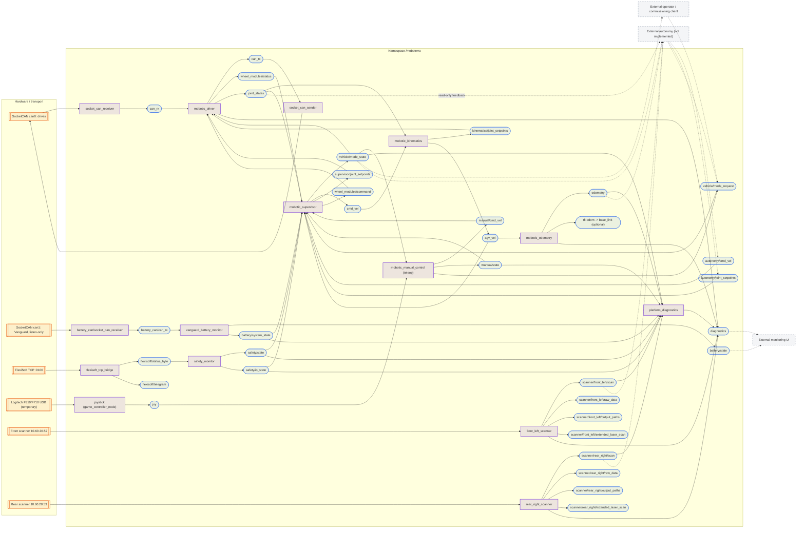
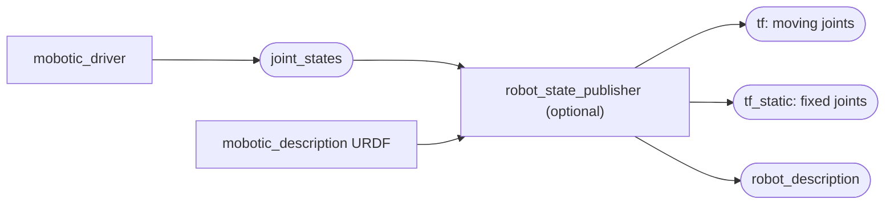
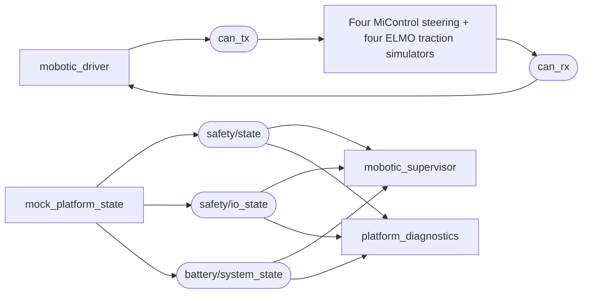

# MoboTerra ROS graph

Source-derived hardware node/topic graph for the default `/moboterra` namespace,
updated 2026-10-08. This is **not a captured live rqt_graph** or proof of runtime
integration. Rectangles are nodes, rounded shapes are topics; dashed external
nodes/connections are optional consumers/producers not launched by bringup.
Hardware arrows denote transport, not ROS topics.

All topic labels below are namespace-relative. Generic ROS `rosout` and
`parameter_events` plumbing is omitted. Services are listed separately.

## Configuration ownership

`mobotic_config/config/platform.yaml` feeds driver, supervisor, kinematics,
manual caps, battery/safety mapping, scanner endpoints, virtual actuators and the
Xacro description. Adjacent YAML files own only their node policies. Configuration
loading is not a ROS node/topic and therefore does not add arrows to this graph.
Diagnostics use effective supervisor/driver freshness limits; scanner and odometry
health deadlines have their own diagnostic policy. Hardware topic routing below
is unchanged by this consolidation. See [configuration guide](../src/mobotic_config/README.md).

## Hardware profile: whole project



SocketCAN node labels are the expected names from the external bridge launch;
check the installed package's actual node names in the live graph. Scanner
auxiliary topics are the configured native-driver remappings; their runtime
availability depends on the scanner configuration/driver.

## Important distinctions

| Interface | Function |
|:--|:--|
| `manual/cmd_vel`, `autonomy/cmd_vel` | Candidate body velocities; only the supervisor selects one |
| `autonomy/joint_setpoints -> supervisor/joint_setpoints` | Optional external-kinematics motion path through supervisor; not wheel management |
| `cmd_vel -> kinematics/joint_setpoints` | Supervised velocity-to-joint motion path |
| `wheel_modules/command` | One `WheelModuleCommand`: enable/disable and clear errors on all units |
| `wheel_modules/status` | `WheelModuleStatusArray`: module readiness/faults with `feedback_fresh` |
| `vehicle/mode_request` | MANUAL/AUTO_VELOCITY requests only; Back toggles using reported mode; supervisor stops before switching |
| `vehicle/mode_state` | Authoritative mode for the USB Back toggle and driver-exclusive kinematics (0/1) or direct (2) routing |
| `joint_states -> agv_vel` | Measured joints/body velocity for standstill verification and odometry input |
| `agv_vel -> odometry` | Timestamped planar wheel pose/twist/covariance, not commanded-motion integration |
| `tf: odom -> base_link` | Optional wheel-odometry transform; disable when an external estimator owns it |
| `battery/state` | Single standard battery telemetry output; supervisor does not subscribe |
| `battery/system_state` | Aggregate readiness/minimum SOC; supervisor and platform diagnostics subscribe |
| `safety/io_state` | Additional supervisor interlock input and diagnostics; unknown STO/enable mappings remain explicit |
| `diagnostics` | Shared driver/platform/native-scanner health output; no control authority |

The teleop role is implemented by `mobotic_manual_control`; `joystick` remains a
separate `game_controller_node`. The supervisor receives manual state rather than subscribing
directly to raw `joy`.

Scanner protective fields reach ROS supervision through FlexiSoft, not through a
new scan-based safety algorithm. Laser scans feed diagnostics and optional autonomy.
Physical ELMO/FlexiSoft STO wiring is **not** a ROS edge. Raw ELMO safety-register
values appear inside driver diagnostics; their bit meanings are not guessed.

Enable depends on fresh ready safety/battery and SOC >=20%. Motion additionally
requires a valid selected source and fresh enabled fault-free drive feedback.
A fresh status publication alone is insufficient when `feedback_fresh=false`.
Default bringup now includes wheel odometry and odom-to-base TF, but still not
`robot_state_publisher`. The optional
standalone [description launch](../src/mobotic_description/README.md) adds this
branch, without changing motion routing (CAD floor/axis placement is now confirmed):



These topics use the same `/moboterra` namespace as odometry TF. The description
does not duplicate `odom -> base_link`. Its `tf_static` now includes nominal
CAD/manufacturer-aligned `chassis -> front_left_scan` and
`chassis -> rear_right_scan` transforms matching the scanner message frame IDs;
these are not physically calibrated extrinsics.

## Services (not displayed by rqt_graph)

| Default service | Type | Server |
|:--|:--|:--|
| `/moboterra/vehicle/set_mode` | `mobotic_interfaces/srv/SetVehicleMode` | Supervisor; modes 0/1/2, only API accepting AUTO_DIRECT |
| `/moboterra/initialize_all_drives` | `std_srvs/srv/Trigger` | Driver |
| `/moboterra/enable_all_drives` | `std_srvs/srv/Trigger` | Driver; fresh enable lease required |
| `/moboterra/disable_all_drives` | `std_srvs/srv/Trigger` | Driver |
| `/moboterra/clear_errors` | `std_srvs/srv/Trigger` | Driver |
| `/moboterra/odometry/reset` | `std_srvs/srv/Trigger` | Odometry; fresh measured standstill required |

See the [supervisor interface contract](supervisor_interfaces.md) and
[watchdog/commissioning guide](hardware_monitoring.md).

## Virtual profile differences

The common driver/kinematics/odometry/supervisor/diagnostics interfaces remain; these
local nodes replace the physical CAN and safety/battery boundaries:



No SocketCAN bridge, physical scanners, FlexiSoft bridge/monitor or Vanguard
monitor runs in virtual mode. Manual nodes are still optional. Driver PDO paths
use the same configuration as hardware mode. Virtual nodes implement the production
SDO/enable and synchronous PDO layouts, not physical motor/brake/STO behavior.
Protocol regression tests pass; full ROS end-to-end simulation is not yet validated.
Mock readiness does not bypass drive-feedback gates, and no mock public
`battery/state` is published.

## Inspect the live graph

On the configured ROS host, after building/sourcing the workspace:

```bash
ros2 launch mobotic_bringup moboterra.launch.py stack_type:=hardware robot_name:=moboterra
rqt_graph
```

Select **Nodes/Topics (all)** and disable **Hide leaf topics**.
External autonomy inputs/consumers appear only when matching nodes are running;
some unpublished/unconnected topics may still be hidden by rqt. Use
`ros2 topic list -t`, `ros2 node info /moboterra/mobotic_supervisor` and
`ros2 service list -t` to inspect interfaces not visible in the graph.
